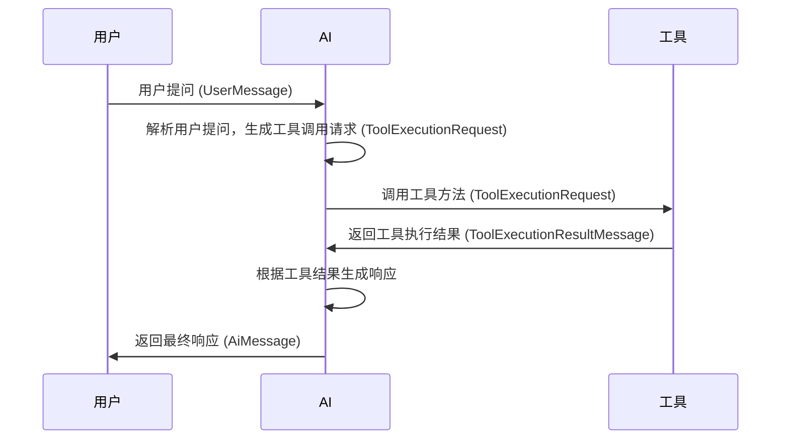
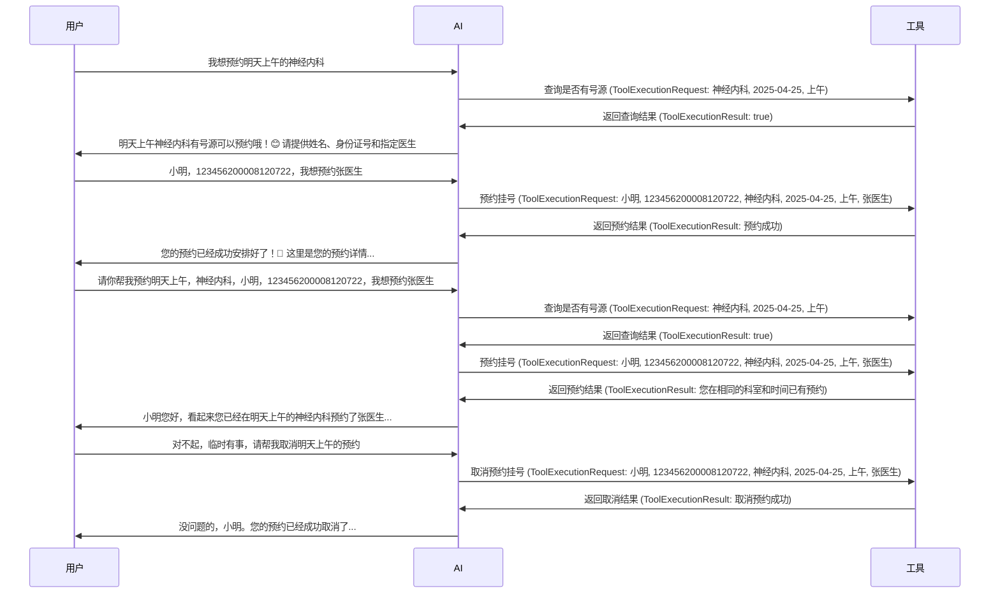

### 智能医疗客服：小医仙助手
大模型智能医疗客服系统，基于LangChain4j框架。

1. 支持多种大语言模型调用方式： 
- 官网API调用
- ollama本地调用 
- 阿里百炼调用

2. 采用mongoDB持久化聊天记忆，mysql持久化用户信息。

支持聊天记忆隔离，Function Calling函数调用（提出问题时，大语言模型会判断是否使用某个工具）。

3. 大语言模型的函数调用流程：

以预约挂号的一次对话为例：
